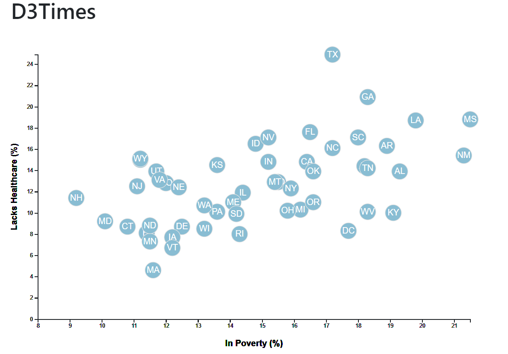
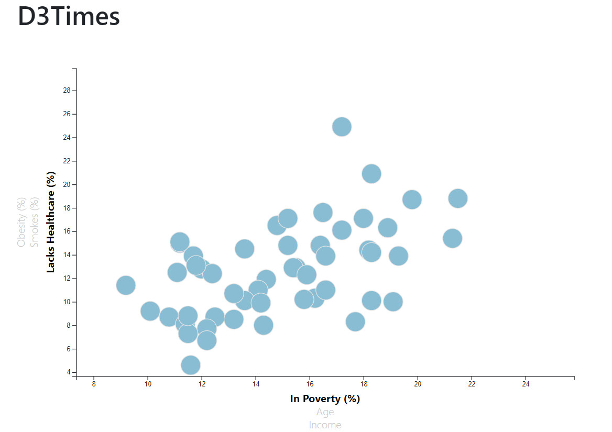
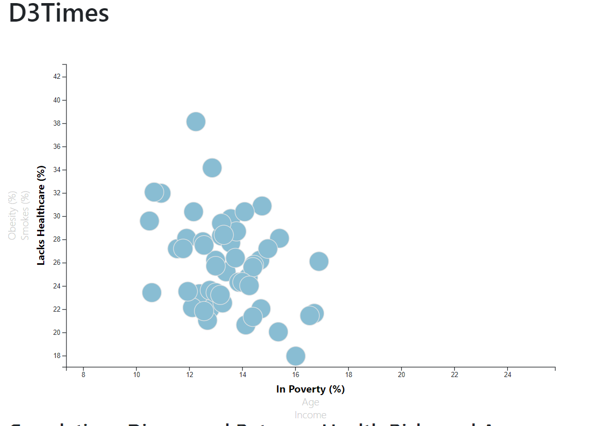
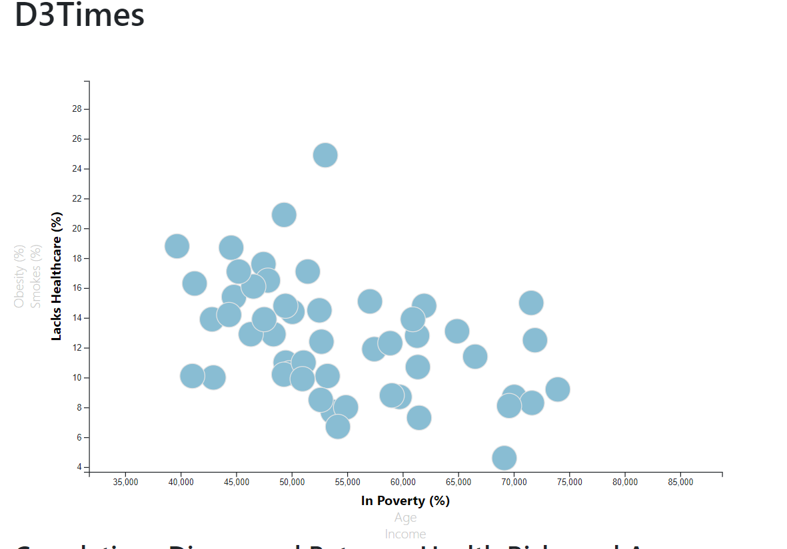

# d3-challenge

Image of final visualization for first challenge. 

Below are examples of the final visualiation for the bonus challenge. I was unable to get the state acronyms in the circles and unable to get the x and y labels to properly
change font when a user selected one of the label choices. However, I was able to get the data circles to rearrange in response to the users selection of the x and y label choices. 

